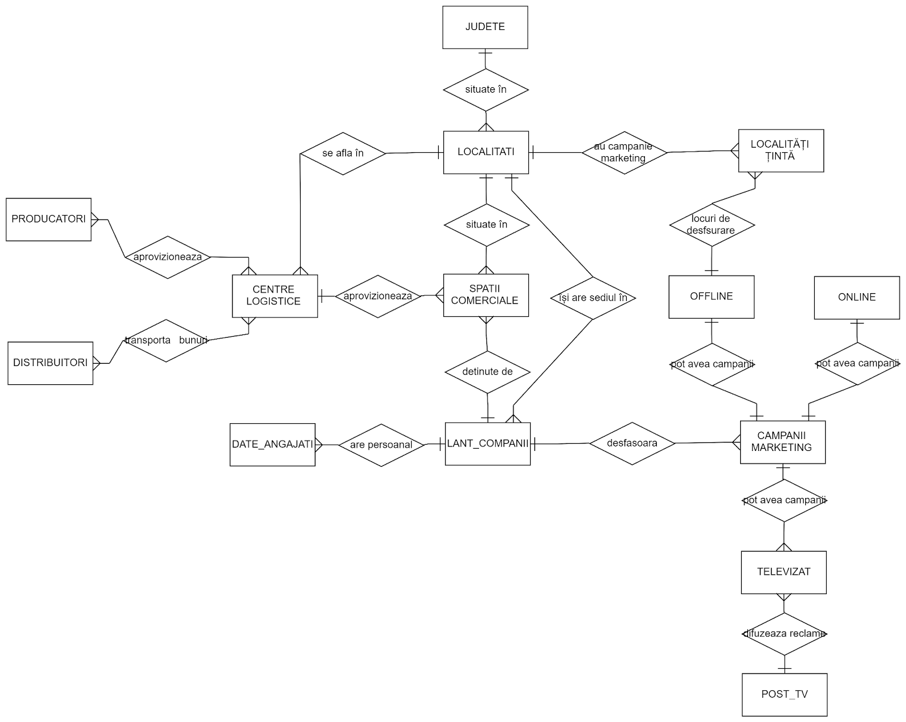
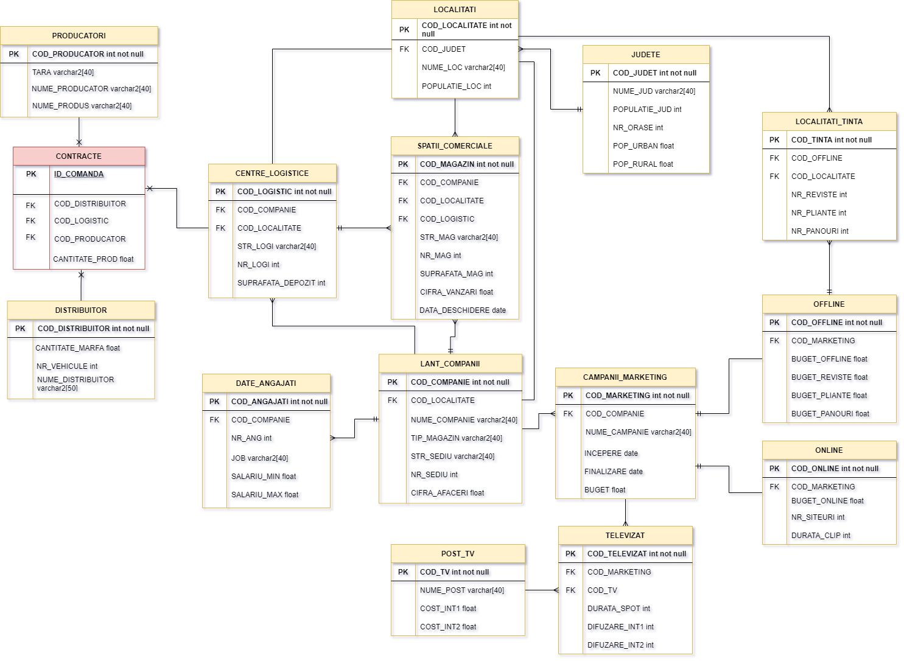

# RSMS (Romanian supermarkets management system)

Data warehouse managing the logistics and financial statements of supermarkets from Romania.

### Description

---

The store management system has as its starting point the **commercial space**, which will be categorized according to the **company** that manages it and about which general information will be known regarding the location (**city** and **county**) and **employees** (salary data and the number of employees for each separate job).

In order for each store to function properly and supply easily, they will depend on a single **logistics center** to distribute their goods. In turn, the logistics centers will procure the products from various **partner companies**, which may be based in the country or abroad and which are in direct relationship with the **distributors** to deliver the goods. 

Consumers are up to date with the latest offers available, as companies carry out **marketing campaigns**, which are divided according to the communication channel through which they are published: 

- **offline** (magazines, leaflets, billboards)
- **televised** 
- **online**

Television media coverage will be done with certain costs, depending on the chosen television station (and depending on one of the time slots chosen: slot I from 08:00 to 16:00 or slot II from 16:00 to 23:00 ), while for offline media the target localities will be taken into account.

### Database schemas

  

 

  

